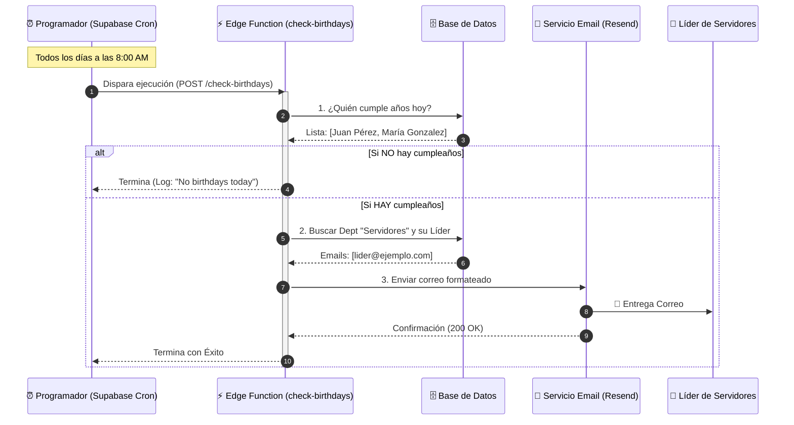

# Ejemplo de Comportamiento: Sistema de Notificaciones de Cumpleaños

Este documento ilustra cómo funciona el sistema automático que hemos implementado.

## 1. Flujo del Proceso (Diagrama)

---

## 2. Ejemplo del Correo Recibido

Si hoy cumplieran años **Juan Pérez** y **María González**, el líder recibiría un correo con este aspecto:

> **Asunto:** 🎉 Cumpleaños del día: Juan Pérez, María González
>
> **De:** Ujieres App <onboarding@resend.dev>
>
> **Para:** <lider@ejemplo.com>

### Vista Previa del Contenido

**¡Hoy hay cumpleaños!**

Las siguientes personas celebran su vida hoy:

* **Juan Pérez** (1990-01-03)
* **María González** (1995-01-03)

No olvides saludarlos.

---

## 3. Escenarios Posibles

| Escenario | Resultado |
| :--- | :--- |
| **Hay cumpleaños + Hay líder Servidores** | ✅ Se envía el correo con la lista. |
| **No hay cumpleaños** | ⏸️ El sistema se detiene, escribe en el log "No birthdays today" y no envía nada. |
| **Hay cumpleaños + No hay líder Servidores** | ⚠️ El sistema no encuentra a quién enviar y guarda un error en el log "No leader found for Servidores". |
